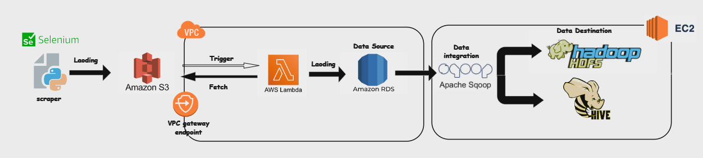

# Data Pipeline Architecture

This project illustrates a data pipeline that collects, processes, and integrates the data of the top 250 movies with the highest IMDb ratings. The pipeline uses various AWS services, Selenium, and Apache Sqoop, moving data from a web scraper to an EC2-hosted Hadoop system with Hive for further analysis.

## Architecture Components

### 1. **Selenium Web Scraper**
   - **Purpose**: Collects data on the top 250 movies with the highest ratings from IMDb.
   - **Process**: A Python script using Selenium scrapes the IMDb website and saves the data.
   - **Output**: The scraped data is stored in an Amazon S3 bucket.

### 2. **Amazon S3**
   - **Purpose**: Serves as the temporary storage for the data.
   - **Process**: The scraped data file is uploaded to an S3 bucket after collection.
   - **Trigger**: S3 triggers an AWS Lambda function to process the data upon file upload.

### 3. **AWS Lambda**
   - **Purpose**: Processes and loads data into Amazon RDS.
   - **Process**: Lambda is triggered by an S3 event when new data is uploaded. It fetches the data file, processes it, and loads the processed data into an Amazon RDS MySQL instance.
   - **Networking**: Communicates with Amazon RDS through a VPC and VPC gateway endpoint to get data from the S3.

### 4. **Amazon RDS (MySQL)**
   - **Purpose**: Acts as a relational database to store the processed data.
   - **Database**: MySQL database is hosted on Amazon RDS.
   - **Data Access**: Data in Amazon RDS is accessible for further integration.

### 5. **Apache Sqoop**
   - **Purpose**: Transfers data from Amazon RDS to Hadoop's HDFS.
   - **Process**: Sqoop pulls data from the MySQL database in Amazon RDS and moves it to HDFS.
   - **Data Integration**: Apache Sqoop enables data integration between RDS and HDFS.

### 6. **Hadoop HDFS**
   - **Purpose**: Acts as the data storage destination for big data processing.
   - **Storage**: HDFS stores the transferred data from RDS, providing scalability and fault tolerance for large datasets.

### 7. **Apache Hive**
   - **Purpose**: Provides SQL-like (HiveQL) querying on data stored in HDFS.
   - **Integration**: Hive allows for analytical queries on the data stored in Hadoop.

### 8. **Amazon EC2**
   - **Purpose**: Hosts the Hadoop and Hive components.
   - **Setup**: An EC2 instance is set up with Hadoop and Hive to enable big data storage and processing.

## Data Flow Overview

1. **Web Scraping**: Selenium scrapes data from IMDb on the top 250 highest-rated movies and saves it to S3.
2. **Triggering Lambda**: S3 triggers AWS Lambda upon data upload.
3. **Data Processing**: Lambda processes the data and loads it into Amazon RDS MySQL.
4. **Data Transfer**: Apache Sqoop extracts data from RDS and imports it to Hadoop HDFS.
5. **Data Analysis**: Apache Hive provides an SQL-like interface for querying data stored in HDFS.

## Prerequisites

- **AWS Services**: S3, Lambda, RDS (MySQL), VPC, EC2
- **Software**: Selenium, Python, Apache Sqoop, Hadoop, Hive
- **Networking**: Configured VPC and VPC gateway endpoints for data transfer.
